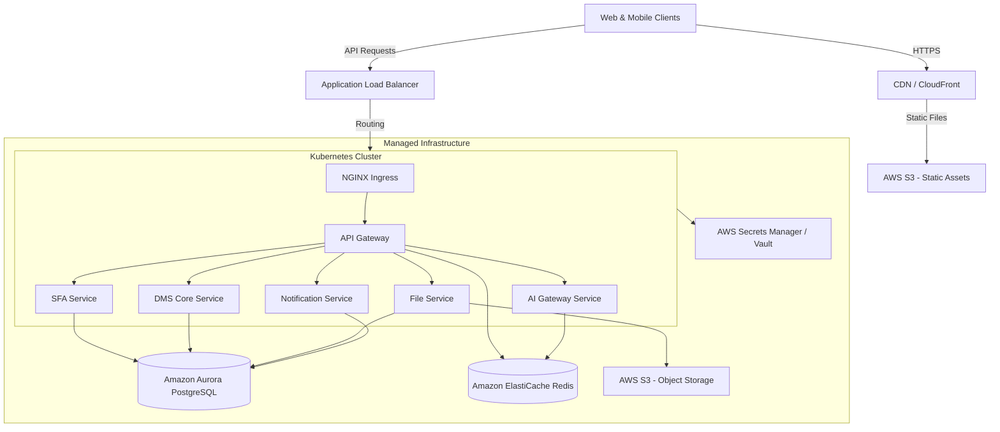

# Production Deployment Guide: Enterprise DMS & SFA Platform

This guide outlines the production deployment strategy, containerization pipeline, cloud infrastructure architecture, and rollout procedures for the multi-tenant Distributor Management System (DMS) and Sales Force Automation (SFA) monorepo.

---

## 1. Production Architecture Overview

In production, the platform transitions from development containers (Docker Compose) to a highly available, auto-scaling, cloud-native architecture.



---

## 2. Containerization Strategy

To keep Docker images lightweight and build times fast, we leverage **Turborepo's Pruning Tool (`turbo prune`)**. This extracts only the source code and dependencies relevant to a specific target microservice, preventing the entire monorepo from being copied into every container image.

### Production Multi-Stage Dockerfile (e.g., `services/api-gateway/Dockerfile`)

Create a Dockerfile in the root of the project or within each service directory to build the target package:

```dockerfile
# ==========================================
# STAGE 1: Prune the workspace
# ==========================================
FROM node:18-alpine AS pruner
RUN apk add --no-cache libc6-compat
WORKDIR /app
RUN npm install -g turbo
COPY . .
# Extract only the target package and its internal workspace dependencies
RUN turbo prune --scope=@dms/api-gateway --docker

# ==========================================
# STAGE 2: Install dependencies & Build
# ==========================================
FROM node:18-alpine AS builder
RUN apk add --no-cache libc6-compat
WORKDIR /app

# Enable pnpm
RUN corepack enable && corepack prepare pnpm@8.15.4 --activate

# Copy pruned workspace metadata for dependency resolution (leveraging Docker layer cache)
COPY --from=pruner /app/out/json/ .
COPY --from=pruner /app/out/pnpm-lock.yaml ./pnpm-lock.yaml
RUN pnpm install --frozen-lockfile

# Copy pruned source code and build packages
COPY --from=pruner /app/out/full/ .
RUN pnpm build --filter=@dms/api-gateway

# Prune devDependencies to keep the production bundle small
RUN pnpm prune --prod

# ==========================================
# STAGE 3: Production Runner
# ==========================================
FROM node:18-alpine AS runner
WORKDIR /app
ENV NODE_ENV=production
RUN apk add --no-cache curl

# Create unprivileged system user for security
RUN addgroup --system --gid 1001 nodejs
RUN adduser --system --uid 1001 nodejs

# Copy built modules and node_modules from builder
COPY --from=builder /app/services/api-gateway/package.json ./package.json
COPY --from=builder /app/services/api-gateway/dist ./dist
COPY --from=builder /app/node_modules ./node_modules
COPY --from=builder /app/services/api-gateway/node_modules ./services/api-gateway/node_modules
COPY --from=builder /app/packages ./packages

USER nodejs

EXPOSE 3000
ENV PORT=3000

# Health check
HEALTHCHECK --interval=30s --timeout=5s --start-period=5s --retries=3 \
  CMD curl -f http://localhost:3000/health || exit 1

CMD ["node", "dist/main.js"]
```

---

## 3. Kubernetes Deployment Manifests

Below is a production-grade Kubernetes manifest template for the **API Gateway** microservice. A similar template applies to all microservices.

### `k8s/api-gateway-deployment.yaml`

```yaml
apiVersion: apps/v1
kind: Deployment
metadata:
  name: api-gateway
  namespace: dms-prod
  labels:
    app: api-gateway
    tier: backend
spec:
  replicas: 3
  revisionHistoryLimit: 5
  strategy:
    type: RollingUpdate
    rollingUpdate:
      maxSurge: 25%
      maxUnavailable: 0
  selector:
    matchLabels:
      app: api-gateway
  template:
    metadata:
      labels:
        app: api-gateway
    spec:
      containers:
        - name: api-gateway
          image: 123456789012.dkr.ecr.us-east-1.amazonaws.com/dms/api-gateway:v1.0.0
          imagePullPolicy: IfNotPresent
          ports:
            - containerPort: 3000
              name: http
          resources:
            limits:
              cpu: "1"
              memory: 1Gi
            requests:
              cpu: 250m
              memory: 512Mi
          envFrom:
            - configMapRef:
                name: dms-global-config
            - secretRef:
                name: api-gateway-secrets
          readinessProbe:
            httpGet:
              path: /health
              port: 3000
            initialDelaySeconds: 5
            periodSeconds: 10
          livenessProbe:
            httpGet:
              path: /health
              port: 3000
            initialDelaySeconds: 15
            periodSeconds: 20
---
apiVersion: v1
kind: Service
metadata:
  name: api-gateway
  namespace: dms-prod
  labels:
    app: api-gateway
spec:
  type: ClusterIP
  ports:
    - port: 80
      targetPort: 3000
      protocol: TCP
      name: http
  selector:
    app: api-gateway
---
apiVersion: autoscaling/v2
kind: HorizontalPodAutoscaler
metadata:
  name: api-gateway-hpa
  namespace: dms-prod
spec:
  scaleTargetRef:
    apiVersion: apps/v1
    kind: Deployment
    name: api-gateway
  minReplicas: 3
  maxReplicas: 10
  metrics:
    - type: Resource
      resource:
        name: cpu
        target:
          type: Utilization
          averageUtilization: 75
    - type: Resource
      resource:
        name: memory
        target:
          type: Utilization
          averageUtilization: 80
```

---

## 4. CI/CD Deployment Pipeline

We utilize GitHub Actions to build, test, and release Docker images directly to an AWS Elastic Container Registry (ECR), followed by rolling out updates to AWS EKS Kubernetes cluster.

### GitHub Actions Workflow: `.github/workflows/deploy.yml`

```yaml
name: Production CD Pipeline

on:
  push:
    branches: [ main ]
    tags: [ 'v*.*.*' ]

permissions:
  id-token: write
  contents: read

jobs:
  validate:
    runs-on: ubuntu-latest
    steps:
      - uses: actions/checkout@v4
      - name: Install Node & PNPM
        uses: pnpm/action-setup@v2
        with:
          version: 8.15.4
      - uses: actions/setup-node@v4
        with:
          node-version: 18
          cache: 'pnpm'
      
      - name: Install dependencies
        run: pnpm install --frozen-lockfile
      - name: Build monorepo
        run: pnpm build
      - name: Lint code
        run: pnpm lint
      - name: Run test suite
        run: pnpm test

  build-and-deploy:
    needs: validate
    runs-on: ubuntu-latest
    strategy:
      matrix:
        service: [api-gateway, ai-gateway-service, file-service, forecasting-service, notification-service, recommendation-service, report-service]
    steps:
      - uses: actions/checkout@v4

      - name: Configure AWS Credentials (OIDC)
        uses: aws-actions/configure-aws-credentials@v4
        with:
          role-to-assume: arn:aws:iam::123456789012:role/github-actions-ecs-deploy-role
          aws-region: us-east-1

      - name: Login to Amazon ECR
        id: login-ecr
        uses: aws-actions/amazon-ecr-login@v2

      - name: Build, tag, and push image to Amazon ECR
        env:
          ECR_REGISTRY: ${{ steps.login-ecr.outputs.registry }}
          IMAGE_TAG: ${{ github.sha }}
        run: |
          docker build \
            -t $ECR_REGISTRY/dms/${{ matrix.service }}:$IMAGE_TAG \
            -t $ECR_REGISTRY/dms/${{ matrix.service }}:latest \
            -f services/${{ matrix.service }}/Dockerfile .
          docker push $ECR_REGISTRY/dms/${{ matrix.service }}:$IMAGE_TAG
          docker push $ECR_REGISTRY/dms/${{ matrix.service }}:latest

      - name: Update Kubernetes Deployments
        run: |
          aws eks update-kubeconfig --name dms-production-cluster --region us-east-1
          kubectl set image deployment/${{ matrix.service }} ${{ matrix.service }}=${{ steps.login-ecr.outputs.registry }}/dms/${{ matrix.service }}:${{ github.sha }} -n dms-prod
          kubectl rollout status deployment/${{ matrix.service }} -n dms-prod
```

---

## 5. Production Database Migrations

Production relational migrations (in PostgreSQL) should **never** be executed dynamically from individual microservices at startup. Doing so causes schema locks, concurrent migration crashes, and rollout bottlenecks during service auto-scaling.

### Rollout Migration Best Practices
1. **Tooling**: Use **Flyway** (which is already structured in `db/migrations/`) or **Prisma/TypeORM** migrations outside the application runtime.
2. **Pipeline Integration**: Execute migrations as a **one-off pre-deploy script** inside the CD pipeline before running `kubectl rollout`.
3. **Backward Compatibility (Expand & Contract Pattern)**: 
   - All schema changes must be backward-compatible (e.g., adding columns must be optional, renaming a column requires adding the new column first, replicating data, and only dropping the old column in a subsequent release). This guarantees zero-downtime rolling updates.

---

## 6. Secrets & Config Management

- **ConfigMaps**: Store non-sensitive configuration values (e.g., database hostnames, API endpoints, log levels, enabled features) and mount them as environment variables.
- **Secrets**: Inject secrets (e.g., database passwords, OpenAI keys, JWT private keys, encryption salts) dynamically at runtime from secure vaults (e.g., AWS Secrets Manager, GCP Secret Manager, or HashiCorp Vault).
- **Encryption at Rest**: Ensure PostgreSQL backups, S3 buckets, and Redis nodes are encrypted using KMS-managed keys.

---

## 7. Production Checklist

- [ ] Configure database connection pools correctly (`max_connections` matching CPU/RAM capacity).
- [ ] Enable structured JSON logging on standard output (`process.stdout`).
- [ ] Configure APM monitoring (Datadog, Dynatrace, or OpenTelemetry with Prometheus/Jaeger).
- [ ] Set up backup policies for PostgreSQL (daily snapshots with 30-day retention) and S3 cross-region replication.
- [ ] Configure CORS origins and NGINX rate-limit rules.
- [ ] Restrict Vault / Secrets Manager permissions to IAM roles matching specific Kubernetes ServiceAccounts via IRSA (IAM Roles for Service Accounts).
